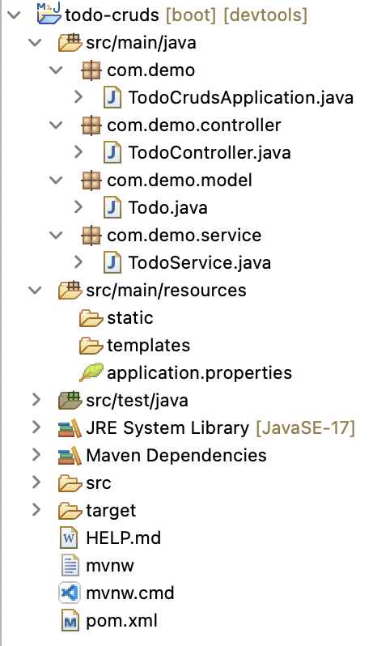

# springboot-todo-cruds-app

This mini project develops a Spring MVC Todo Management web application using `Spring Boot` and `Spring MVC`. The application will be available at [http://localhost:8080](http://localhost:8080)

The following features are implemented in this mini todo management project:

- Create Todo
- Update Todo
- Delete Todo
- List Todos
- Get Todo by id

## Tools and Technologies Used
- Spring Boot 3.2.2
- JDK 17
- Spring Framework 6.1.3
- Maven 3.9
- Spring Tool Suite4 (STS)

## Project Structure

## API Endpoints
| Endpoint | Method | Description |
|---|---|---|
| /users/{name}/todos | GET | Get all todos by user name. |
| /users/{name}/todos/{id} | GET | Get a single todo by id. |
| /users/{name}/todos | POST | Create a new todo. |
| /users/{name}/todos/{id} | DELETE | Delete a todo by id. |
| /users/{name}/todos/{id} | PUT | Update a todo by id. |